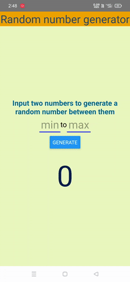

# Random Number

This is a random number generator react-native app.
Takes 2 numbers(min and max) and gives a random number within a specified range,
when user clicks on the button.
## Built with

* React-Native

  
## Lessons Learned

I learnt about react-native.
I learnt on generating a random number of the specified range.
I was able to set up development environment for building react-native application.

## Demo

  
## Features

- Create a random number with specified range.

  